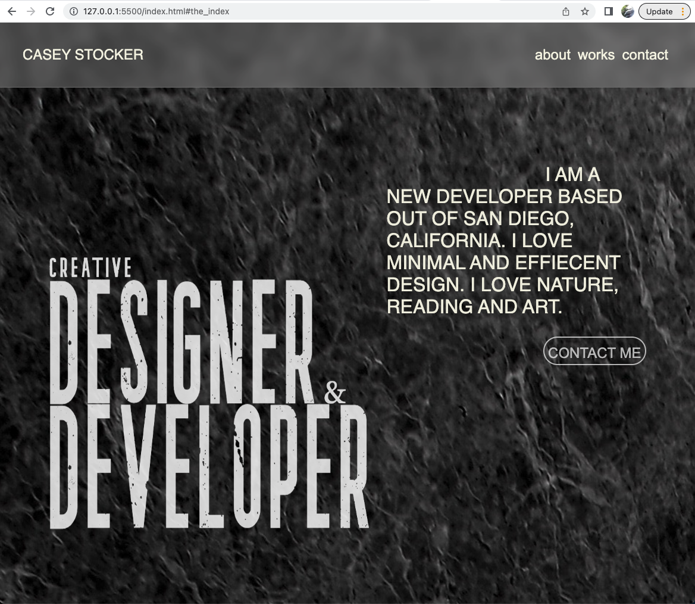

# Portfolio #

 The first portfolio of Casey Stocker by Casey Stocker 

[Check out my portfolio here](https://case02.github.io/Portfolio/)

[ ] screenshot of the app
# 

[ ] List of the Technologies used
- all photos are from pexels.com
- visual studio code text editor
- languages: css, html, jquery, and javascript

[ ] Installation instructions
- no installations necessary

[ ] Your User stories:
- I want the user to easily access and experience my projects(future projects) and also any code of the projects, so that the user has an understanding of my skillset and experience. 
- I want the user to get a better idea of who I am personally and my goals for work so that they have an idea of who is behind the work.

[ ] Wireframes: 
# 
# 
# 

[ ] Unsolved problems:
- not very responsive, several overlaps of different divs at certain monitor widths
- certain jquery snippet didnt work as I'd like
- events seem glitchy and not smooth in transition
- styling and css are not DRY 
- too much empty space in media format
- more transitional animations and transformations would be cool